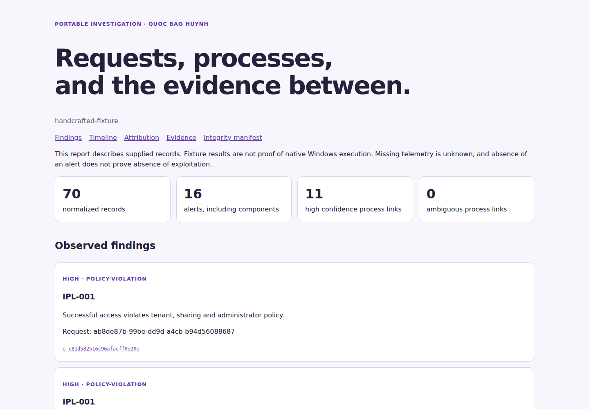

# IIS Purple Lab: Windows Web-to-Host Detection and Response

**Portable preview · Quoc Bao Huynh · AI-assisted lab study. Native IIS capture and remediation validation are pending.**

**The idea.** A fictional company runs a Windows customer-support portal with private tenant tickets and report exports. This lab investigates whether application and endpoint evidence can explain an attack, its affected resources, and the strength of a request-to-process link.

**What it does.** The [support application](app/IisPurpleLab) has separate vulnerable and hardened configurations. [Actual portable HTTP checks](reports/validation/portable-http.json) reproduce cross-tenant access and its repair without a child process. The [fixture demo](reports/generated/demo/report.html) connects report requests to authored process records, with explicit confidence. [Native Windows scripts](docs/windows-runbook.md) are implemented; real Windows execution/capture remains unvalidated.

**How it helps the company.** The workflow could help developers verify authorization fixes and analysts decide which resources or processes need investigation. [Three case reports](reports/cases) link decisions to records. Reduced investigation time or business loss is a potential benefit, not a measured claim.

**The outcome.** Delivered: the application, six executable detections, a portable evidence/report pipeline, three fixture case reports, two [vulnerability/fix reports](reports/vulnerabilities), and a scoped Windows collector. On 19 held-out handcrafted runs, combined analysis detected 6 of 7 labelled attacks and alerted on 1 of 12 benign runs. [Results and limits](reports/generated/evaluation/evaluation.md) distinguish these logic checks from native security outcomes.

**Comparison with another method.** The same fixtures yield 0/7 detected with IIS-only, 2/7 with IIS plus application, and 4/7 with Windows-only. A tuned interpreter rule reduces false-positive report runs from 6 to 1 while retaining the same 4 positives. This small authored workload does not establish superiority over a SIEM/EDR or general operational savings.

**Experience gained.** The project offers reproducible exercises in policy testing, detection engineering, evidence attribution and incident response. [The learning checklist](docs/learning-checklist.md) asks the owner to investigate an unfamiliar case, change a rule, demonstrate a fix and explain a blind spot before claiming personal proficiency.

## Report preview



Actual report rendering from the bundled handcrafted fixtures. Desktop, mobile and dark-mode [browser checks](reports/validation/browser.json) passed, including filters and evidence expansion. Open the [HTML report](reports/generated/demo/report.html) locally after cloning; GitHub displays its source.

## Quick start

Python 3.11+; tested here with 3.14.4. Run from this repository root. No IIS, Docker, paid service or LLM API is required for replay.

```bash
python -m venv .venv
source .venv/bin/activate
python -m pip install -r requirements.lock
python -m pip install --no-deps --no-build-isolation -e .
python -m iis_purple demo --dataset datasets/fixtures/heldout --output artifacts/demo
python -m iis_purple evaluate --dataset datasets/fixtures/heldout --output artifacts/evaluation
python -m pytest tests scenarios/test_harness.py -q
```

On Windows use `.\.venv\Scripts\Activate.ps1` instead of `source`, or invoke `.\.venv\Scripts\python.exe` directly. Open `artifacts/demo/report.html` locally. Its expandable evidence, source files, process links and hashes come from the analysis output. Bundled examples are explicitly **handcrafted fixtures**, not sanitized Windows captures.

For application checks, install SDK **10.0.401** from Microsoft, then:

```bash
dotnet restore app/IisPurpleLab.Tests/IisPurpleLab.Tests.csproj --locked-mode
dotnet test app/IisPurpleLab.Tests/IisPurpleLab.Tests.csproj --no-restore
python scenarios/portable_check.py
```

Tests use in-process HTTP and a mocked process launcher. The separate portable check runs real local Kestrel HTTP for access control and managed exports. Native execution requires the [disposable Windows VM runbook](docs/windows-runbook.md).

## Results and evidence

| Metric | Baseline | Observed result | Evidence | Limitation |
| --- | --- | --- | --- | --- |
| Held-out attack coverage | IIS-only 0/7 | Combined 6/7 | [Evaluation](reports/generated/evaluation/evaluation.md) | Handcrafted workload; one unlogged policy case missed. |
| False-positive report runs | Basic ancestry 6/6 benign | Tuned interpreter 1/6 | [Same-case comparison](reports/generated/evaluation/evaluation.json) | Legitimate shell maintenance still alerts; 4/4 suspicious report runs retained. |
| Application remediation | Cross-tenant GET 200 | Same GET 403; legitimate reads 200 | [14 actual HTTP checks](reports/validation/portable-http.json) | Kestrel, not IIS; no native payloads executed. |
| Offline processing | Same source files/view | Per-view measured seconds and bytes | [Metrics](reports/generated/evaluation/evaluation.json) | Excludes collection; not live latency or CPU overhead. |
| Native process attribution / remediation | Required Windows capture | Not measured | [Remaining gates](docs/windows-runbook.md#required-evidence-before-a-validated-windows-release) | Disposable Windows VM unavailable. |
| Analyst productivity / savings | No controlled study | Not measured | [Limitations](docs/limitations.md) | No ROI or production effectiveness claim. |

Start with [verification status](IMPLEMENTATION_STATUS.md), [fresh-checkout runbook](docs/runbook.md), [architecture](docs/architecture.md), [policy](docs/access-policy.md), [detection catalogue](detections/README.md), [five-minute demo](docs/demo.md), or [project brief](docs/project-brief.md). Native evidence stays local and ignored by git. GitHub Actions configuration is provided, but has not run on GitHub; local checks are recorded separately.

Source and original lab fixtures are [MIT licensed](LICENSE); vendor dependencies retain their own licences. [Attribution and primary references](docs/sources.md). No vendor installers, native endpoint logs, real customer records, paid bounty claims, or employer endorsements are bundled.
