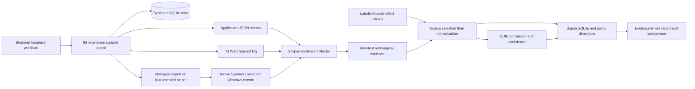

# Architecture

On the VM the application runs inside the dedicated `w3wp.exe` process. The native preflight checks this observed topology and token privileges. Direct helper launches record host/parent/child/time/request/job context; descendants need native ParentProcessGuid evidence. The unsafe lab branch is deliberate and off by default; remediation uses managed output or a fixed compiled helper.

The portable command starts at the dataset manifest and uses exactly the same normalization, correlation and detection code as native bundle analysis. It does not emulate an IIS process. Four research views remove sources before normalization. Evaluation labels are loaded only after detector outputs exist.

Original project contribution: the small policy-aware portal, paired vulnerable/hardened flows, launch-boundary instrumentation, bounded workloads, collector ownership controls, normalization/evidence provenance, conservative attribution, contextual rules, source-ablation comparison and review reports. Microsoft supplies IIS/.NET/Sysmon/event logging; SigmaHQ supplies the rule language and conversion backend; SQLite executes the converted event queries. None of these vendor tools alone constitutes this project's research result.
